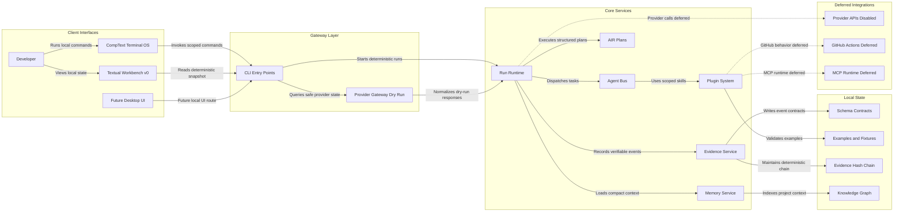
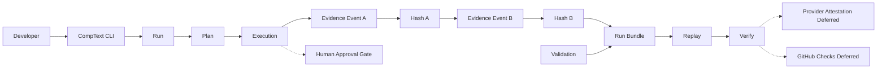

# CompText

<p align="center">
  <b>Local AI orchestration for software engineering.</b><br/>
  A Windows-first, local-first runtime for plans, evidence, provider configuration, skills, hooks, subagents, deterministic validation, and terminal workbench flows.
</p>

<p align="center">
  
  
  
  
  
  
  
  <a href="https://github.com/ProfRandom92/Comptext/actions/workflows/ci.yml"></a>
</p>

CompText is a local AI orchestration platform for software engineering. It is not a package release, hosted service, desktop app, live provider router, or production-ready system. This repository is a local dry-run MVP seed for the `comptext` CLI, the local Textual Workbench, Antigravity workspace skills, and surrounding contracts.

## What CompText Changes

CompText replaces the simple pattern:

```text
Prompt -> Answer
```

with a bounded engineering workflow:

```text
Run -> Plan -> Execution -> Evidence -> Replay -> Verify
```

The goal is to make AI-assisted engineering work structured, reviewable, replayable, and constrained by explicit local safety rules.

## Architecture


```mermaid
flowchart LR
  subgraph client ["Client Interfaces"]
    user["Developer"]
    terminal["CompText Terminal OS"]
    workbench["Textual Workbench v0"]
    desktop["Future Desktop UI"]
  end

  subgraph gateway ["Gateway Layer"]
    cli["CLI Entry Points"]
    providerGateway["Provider Gateway Dry Run"]
  end

  subgraph service ["Core Services"]
    runtime["Run Runtime"]
    agentBus["Agent Bus"]
    air["AIR Plans"]
    evidence["Evidence Service"]
    memory["Memory Service"]
    plugins["Plugin System"]
  end

  subgraph datastore ["Local State"]
    schemas["Schema Contracts"]
    fixtures["Examples and Fixtures"]
    hashChain["Evidence Hash Chain"]
    knowledgeGraph["Knowledge Graph"]
  end

  subgraph external ["Deferred Integrations"]
    providers["Provider APIs Disabled"]
    github["GitHub Actions Deferred"]
    mcp["MCP Runtime Deferred"]
  end

  user -->|"Runs local commands"| terminal
  user -->|"Views local state"| workbench
  terminal -->|"Invokes scoped commands"| cli
  workbench -->|"Reads deterministic snapshot"| cli
  desktop -->|"Future local UI route"| cli
  cli -->|"Starts deterministic runs"| runtime
  cli -->|"Queries safe provider state"| providerGateway
  providerGateway -->|"Normalizes dry-run responses"| runtime
  runtime -->|"Executes structured plans"| air
  runtime -->|"Dispatches tasks"| agentBus
  agentBus -->|"Uses scoped skills"| plugins
  runtime -->|"Records verifiable events"| evidence
  runtime -->|"Loads compact context"| memory
  evidence -->|"Writes event contracts"| schemas
  evidence -->|"Maintains deterministic chain"| hashChain
  memory -->|"Indexes project context"| knowledgeGraph
  plugins -->|"Validates examples"| fixtures
  runtime -.->|"Provider calls deferred"| providers
  plugins -.->|"GitHub behavior deferred"| github
  plugins -.->|"MCP runtime deferred"| mcp
```

## Local Terminal and Workbench v0

The current local-v0 surface is terminal-first and dry-run-only:

```bash
comptext status --dry-run
comptext agents --dry-run
comptext verify --dry-run
comptext validate workspace --dry-run
comptext doctor --dry-run
comptext tui --dry-run
```

`comptext tui --dry-run` opens the local Textual Workbench v0 when Textual is available. The workbench visualizes a deterministic snapshot of existing local CompText state: status, doctor diagnostics, workspace validation, verification, evidence summary, provider boundary, MCP boundary, local agent inventory, workspace skills, commands, and known limitations.

The workbench does not call providers, use the network, call GitHub APIs, use MCP runtime behavior, start servers, start real subagents, mutate workspace files while rendering, or fix Antigravity `/agents` discovery.

## Antigravity Workspace Surface

CompText includes local Antigravity workspace surfaces for guided dry-run operation:

- Workspace skills under [`.agents/skills/`](.agents/skills/)
- Workspace agent role definitions under [`.agents/agents/`](.agents/agents/)
- Plugin source material under [`.antigravity/plugins/comptext-local/`](.antigravity/plugins/comptext-local/)
- Local subagent role documentation in [`docs/SUBAGENTS.md`](docs/SUBAGENTS.md)

The CompText workspace skills are the active AGY-facing workflow surface. Workspace agent definitions are role definitions only; AGY `/agents` discovery remains an observed loader limitation in AGY 1.0.16 and is not treated as runtime support.

## Evidence Chain

CompText treats evidence as a first-class runtime primitive. The current repository includes deterministic sample evidence verification, not live attestation.


```mermaid
flowchart LR
  developer["Developer"] --> cli["CompText CLI"]
  cli --> run["Run"]
  run --> plan["Plan"]
  plan --> execution["Execution"]
  execution --> eventA["Evidence Event A"]
  eventA --> hashA["Hash A"]
  hashA --> eventB["Evidence Event B"]
  eventB --> hashB["Hash B"]
  hashB --> bundle["Run Bundle"]
  bundle --> replay["Replay"]
  replay --> verify["Verify"]
  validation["Validation"] --> bundle
  execution -.-> approval["Human Approval Gate"]
  verify -.-> provider["Provider Attestation Deferred"]
  verify -.-> github["GitHub Checks Deferred"]
```

Every future live execution path should answer:

| Question | CompText answer |
|---|---|
| What happened? | Evidence events |
| In what order? | Ordered run records |
| Was it modified? | Hash-chain verification |
| Can it be replayed? | Run bundle |
| Can it be reviewed? | Compact handoff |
| Can it be trusted blindly? | No. Verify first. |

## Capability Matrix

| Capability | Status | Notes |
|---|---|---|
| Architecture and safety docs | Prepared | Local design and operating boundaries |
| JSON schema contracts | Prepared | AIR, Evidence, Run, plugins, hooks, subagents, approvals, CLI commands |
| Local dry-run CLI | Local v0 | Deterministic commands for status, agents, verify, validation, doctor, evidence, gateway, and run samples |
| Local Textual Workbench | Local v0 | `comptext tui --dry-run`; deterministic local snapshot, no live integrations |
| Antigravity workspace skills | Local v0 | `.agents/skills/*/SKILL.md` dry-run workflows visible through AGY skills loading |
| Antigravity workspace agents | Role definitions | `.agents/agents/*/agent.json`; definitions only, not automatic runtime execution |
| Provider registry | Prepared | Safe states only: `not_configured`, `disabled`, `experimental` |
| Provider Gateway v0 | Dry-run | No server, port binding, secret reads, or live routing |
| Evidence hash-chain | Prepared | Deterministic sample verification |
| Sample run runtime | Dry-run | Local sample execution only |
| PR Review Memory | Local v0 | Static scaffold, skill bridge, renderer, schema contract |
| Token Saver workflow | Companion | Uses local project state and compact handoff discipline |
| Codex local autonomy | Local guidance | Explicitly requested local batches only |
| MCP runtime | Deferred | No live MCP server behavior |
| Desktop app | Deferred | Not implemented |
| Package release | Deferred | No release claim |
| Auto-push, PR, or merge | Forbidden by default | Requires explicit instruction |

## Safety Contract

CompText defaults to local, bounded, and non-destructive behavior.

| Boundary | Current rule |
|---|---|
| Provider calls | Do not perform unless explicitly configured and requested |
| Secrets | Do not store secrets, API keys, raw environment variables, or provider payloads in Evidence or logs |
| GitHub writes | Do not push, open PRs, merge, enable auto-merge, or call GitHub APIs unless explicitly instructed |
| MCP runtime | Deferred; no live runtime behavior in this scaffold |
| Subagent execution | Definitions only unless an explicit local runtime unit implements execution later |
| Review state | Do not automatically resolve ambiguous, unfixed, or out-of-scope comments |
| Claims | Do not make production, security, compliance, legal, forensic, or official compatibility claims |
| Destructive commands | Require explicit approval |

Codex local autonomous batches are governed by [`AGENTS.md`](AGENTS.md) and [`docs/CODEX_LOCAL_AUTONOMY.md`](docs/CODEX_LOCAL_AUTONOMY.md).

## PR Review Memory

The PR Review Memory scaffold is a dry-run companion for token-saving workflows. It defines compact review-memory formats only; it does not replace CompText Token Saver, perform GitHub actions, make network or provider calls, read secrets, or implement an MCP runtime server.

Repo-side pieces:

- [`plugins/pr-review-memory/README.md`](plugins/pr-review-memory/README.md)
- [`plugins/pr-review-memory/SKILL.md`](plugins/pr-review-memory/SKILL.md)
- [`plugins/pr-review-memory/renderer.py`](plugins/pr-review-memory/renderer.py)
- [`plugins/pr-review-memory/schema/pr-review-memory.v0.schema.json`](plugins/pr-review-memory/schema/pr-review-memory.v0.schema.json)
- [`.agents/skills/pr-review-memory/SKILL.md`](.agents/skills/pr-review-memory/SKILL.md)

The local renderer converts structured review-memory dictionaries into compact Markdown. Runtime GitHub integration, MCP runtime behavior, automatic review resolution, automatic merge behavior, and production behavior remain deferred.

## Local Dry-Run Commands

```bash
comptext status --dry-run
comptext agents --dry-run
comptext verify --dry-run
comptext tui --dry-run
comptext doctor --dry-run
comptext validate workspace --dry-run
comptext validate schemas --dry-run
comptext providers list --dry-run
comptext gateway health --dry-run
comptext gateway models --dry-run
comptext gateway sample --dry-run
comptext evidence verify --sample
comptext run sample --dry-run
```

Gateway v0 commands are deterministic local scaffolding only. They do not start a server, bind ports, read secrets or environment variables, call provider APIs, or infer real model availability.

## Start Here

Read:

- [`START_HERE.md`](START_HERE.md)
- [`docs/COMPTEXT_MVP.md`](docs/COMPTEXT_MVP.md)
- [`docs/COMPTEXT_ARCHITECTURE_v1.md`](docs/COMPTEXT_ARCHITECTURE_v1.md)
- [`docs/COMPTEXT_SECURITY.md`](docs/COMPTEXT_SECURITY.md)
- [`docs/LOCAL_V0_WORKSPACE_README.md`](docs/LOCAL_V0_WORKSPACE_README.md)
- [`docs/ANTIGRAVITY_CLI_WORKFLOW.md`](docs/ANTIGRAVITY_CLI_WORKFLOW.md)
- [`docs/SUBAGENTS.md`](docs/SUBAGENTS.md)
- [`docs/CODEX_DESKTOP_WORKFLOW.md`](docs/CODEX_DESKTOP_WORKFLOW.md)
- [`docs/CODEX_DESKTOP_PROMPTS.md`](docs/CODEX_DESKTOP_PROMPTS.md)

## Contributor Orientation

Use `main` as the canonical branch. Create focused branches such as `docs/<topic>`, `plugin/<feature>`, `fix/<bug>`, or `codex/<task>`.

Before changing behavior, check the relevant schema, docs, examples, and tests together. Keep provider states limited to `not_configured`, `disabled`, or `experimental` unless a task explicitly changes that contract.

For local validation, run:

```bash
comptext verify --dry-run
python -m pytest
git diff --check
```

## Roadmap

| Phase | Status language | Focus |
|---|---|---|
| Foundation | Prepared | Docs, schemas, examples, local dry-run CLI |
| Local Terminal v0 | Local v0 | Status, agents, verify, validation, doctor, and installable console entry point |
| Local Textual Workbench v0 | Local v0 | Static local dry-run workbench over deterministic snapshot state |
| Antigravity workspace skills | Local v0 | Workspace skills and plugin surfaces for dry-run workflows |
| Provider Gateway v0 | Dry-run | Deterministic local provider command scaffolding |
| PR Review Memory | Local v0 | Skill bridge, renderer, schema contract, compact handoff |
| Codex local autonomy | Local guidance | Explicitly requested local batches with no push or PR by default |
| Minimal CI gate | Deferred | Validation automation after local contracts settle |
| Evidence digest plugin | Deferred | Compact evidence summaries after renderer patterns stabilize |
| Rich Workbench navigation | Deferred | Keyboard navigation, evidence drilldown, task queue, provider routing |
| Live integrations | Deferred | Provider routing, MCP runtime, and GitHub behavior behind explicit approval gates |
