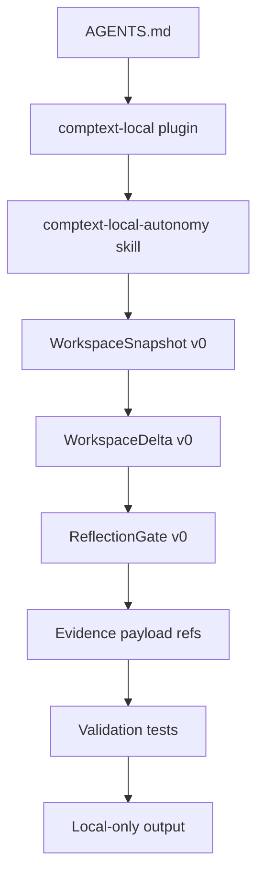
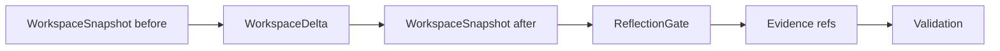
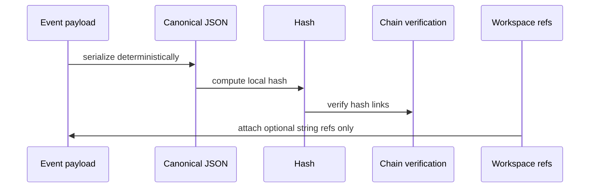

# Local v0 Workspace Contracts


## Summary

This local-v0 workspace batch defines structured, machine-readable contracts and examples for tracking task execution.
- It introduces **WorkspaceSnapshot v0**, **WorkspaceDelta v0**, and **ReflectionGate v0** to enforce offline policy checks.
- It establishes a repo-local **Antigravity plugin bridge** to govern workflow rules and local autonomy.
- It extends the **Evidence hash-chain** with optional workspace reference pointers.
- It remains strictly offline, local-only, and dry-run/scaffold-only.

## Readiness Matrix

| Area | State | Paths | Runtime impact | Boundary |
| :--- | :--- | :--- | :--- | :--- |
| **Antigravity bridge** | Implemented | `.antigravity/plugins/comptext-local/` | Low (metadata/rules loaded) | Enforces rules/skills boundaries |
| **WorkspaceSnapshot v0** | Implemented | `schemas/workspace-snapshot.v0.schema.json` | None (static schema/fixture) | Bounded to local validations |
| **WorkspaceDelta v0** | Implemented | `schemas/workspace-delta.v0.schema.json` | None (static schema/fixture) | Bounded to local validations |
| **ReflectionGate v0** | Implemented | `schemas/reflection-gate.v0.schema.json` | None (static schema/fixture) | Bounded to local validations |
| **Evidence workspace refs** | Implemented | `modules/evidence/evidence.py` | Low (payload checks on creation/verify) | Rejects embedded workspace objects |
| **Provider registry** | Dry-run only | `modules/provider_registry/` | None | Keeps provider state disabled/experimental |
| **Gateway** | Dry-run only | `modules/gateway/` | None | Blocks live API network connections |
| **Runtime sample** | Dry-run only | `modules/runtime/` | None | Verifies no-resource boundaries |
| **PR Review Memory** | Implemented | `plugins/pr-review-memory/` | Low (local rendering logic) | Strictly deterministic local parsing |

## Architecture Flow



## State & Delta Lifecycle



## Hash-Linked Local Evidence Chain

Evidence records are structured as a hash-linked local evidence chain where each event points to the cryptographic hash of the preceding event.
- **String Pointer References**: The `workspace_before_ref`, `workspace_after_ref`, and `workspace_delta_ref` are recorded as simple string pointers inside the event payload.
- **No Embedded Payload Bloat**: To prevent evidence chains from growing excessively large, full `WorkspaceSnapshot` and `WorkspaceDelta` JSON documents are not embedded in the events.
- **Embedded Object Rejection**: Event validation strictly rejects dictionary/object payloads in these fields, maintaining a clean separation of concerns.



## Schema & Validation Matrix

| Area | Schema | Example | Tests | Runtime | Network | Provider |
| :--- | :--- | :--- | :--- | :--- | :--- | :--- |
| **Snapshot** | yes | yes | yes | dry-run | no | no |
| **Delta** | yes | yes | yes | dry-run | no | no |
| **Gate** | yes | yes | yes | dry-run | no | no |
| **Evidence** | n/a | yes | yes | yes | no | no |
| **Gateway** | n/a | n/a | yes | dry-run | no | no |
| **Provider Registry** | yes | yes | yes | dry-run | no | no |
| **Runtime Sample** | n/a | n/a | yes | dry-run | no | no |

## Textual Workbench v0

The Textual Workbench v0 is accessed via:
```bash
comptext tui --dry-run
```

### Constraints & Behavior
- **Local-only / Dry-run-only**: It strictly visualizes existing CompText local state without mutating any files.
- **Strict Offline Containment**:
  - It does not call LLM providers.
  - It does not use the network.
  - It does not call GitHub APIs.
  - It does not use MCP runtime.
  - It does not start real subagents.
  - It does not fix AGY /agents discovery.
- **Dependency Guard**: If the `textual` package is missing in the runtime environment, the command prints `Textual is required for comptext tui --dry-run.` and exits non-zero (1).

## Validation

All components and validation contracts are tested locally. Run the following commands to execute tests and checks:

```bash
# Run the complete test suite
python -m pytest

# Run focused validation tests
python -m pytest tests/validation tests/evidence tests/cli

# Run Textual TUI smoke run
comptext tui --dry-run

# Check git repository for formatting or whitespace issues
git diff --check
```

### Latest Validation Status
- **Tests**: All tests passed.
- **Formatting**: `git diff --check` passed cleanly.

## Non-Goals

The following areas are out of scope and explicitly deferred:
- **No Provider Calls**: Live vendor or LLM model API connections are not supported.
- **No Live GitHub Behavior**: No branch creations, merges, pull requests, or issue writes.
- **No MCP Runtime**: Running or managing a Model Context Protocol tool execution server is deferred.
- **No Runtime Orchestration**: Automatically reading the workspace filesystem to generate snapshots during runtime.
- **No Model-Interpretability Claims**: These schemas are state logs and do not imply direct insights into LLM reasoning/internals.
- **No Production/Security/Compliance Claims**: These schemas are local dry-run scaffolds and are not certified for production auditing.
- **No Secrets or Env Reads**: Secrets and local environment variable reads are strictly forbidden.
- **No Server Operations**: Starting background servers or binding network ports is out of scope.

## Next Local Follow-Up Options

1. **Local CLI Helper**: Implement a standalone helper to validate custom workspace state examples against the v0 schemas.
2. **Evidence Builder Support**: Integrate automatic generation of workspace references inside the evidence generator utility.
3. **ReflectionGate Integration**: Build manual/escalated prompt templates for verifying ReflectionGates inside local CLI scripts.
